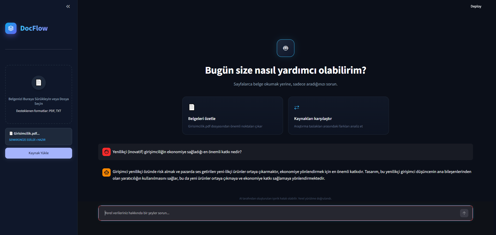

# 🌊 DocFlow: Offline RAG-Based Document Assistant



**DocFlow**, yapay zeka gücünü buluta ihtiyaç duymadan tamamen yerel (offline) makinenizde çalıştıran, veri gizliliği odaklı ve RAG (Retrieval-Augmented Generation) mimarisiyle inşa edilmiş modern bir belge asistanıdır. Yüzlerce sayfalık PDF veya TXT dosyalarınızı saniyeler içinde analiz eder, içeriği bağlamsal olarak anlar ve sorularınızı yalnızca sizin belgelerinizdeki kanıtlara dayanarak yanıtlar.

---

## 📑 İçindekiler
1. [Proje Vizyonu ve Özellikler](#-proje-vizyonu-ve-özellikler)
2. [Sistem Mimarisi](#-sistem-mimarisi)
3. [Kullanılan Teknolojiler](#-kullanılan-teknolojiler)
4. [Kurulum ve Çalıştırma](#-kurulum-ve-çalıştırma)
5. [Kullanım Senaryosu](#-kullanım-senaryosu)
6. [Geliştirici ve Proje Hakkında](#-geliştirici-ve-proje-hakkında)
7. [Lisans](#-lisans)

---

## ✨ Proje Vizyonu ve Özellikler

Günümüzde LLM (Büyük Dil Modelleri) kullanımı hızla artarken, şirket içi hassas verilerin veya kişisel dokümanların üçüncü parti bulut servislerine yüklenmesi büyük bir güvenlik zafiyeti yaratmaktadır. DocFlow, bu sorunu ortadan kaldırmak için tasarlanmıştır.

- 🔒 **%100 Yerel ve Gizlilik Odaklı:** Cihazınızda çalışan donanım hızlandırmalı (CPU/NPU) modeller sayesinde hiçbir veriniz internete sızmaz.
- 🧠 **Halüsinasyon Kalkanı (RAG):** Klasik yapay zekaların aksine, DocFlow bilmediği konularda uydurmaz. Yalnızca yüklediğiniz dokümanlardaki verileri geri getirerek (Retrieval) kanıta dayalı yanıtlar sunar.
- 💅 **Premium UI/UX Deneyimi:** Streamlit'in varsayılan kısıtlamaları CSS Enjeksiyonu (CSS Injection) ile ezilmiştir. Modern karanlık tema (Dark Mode), akıcı animasyonlar ve sezgisel bir sürükle-bırak (Drag & Drop) alanı içerir.
- ⚡ **Hafif ve Hızlı:** Ağır vektör veritabanları yerine, yerel diskte çalışan ve sunucu gerektirmeyen (serverless) optimize edilmiş **SQLite** yapısı kullanır.

---

## ⚙️ Sistem Mimarisi

DocFlow'un çalışma prensibi üç ana faza dayanır:

1. **Ingestion (Veri İçeri Aktarma):** Kullanıcı bir doküman yüklediğinde, `PyMuPDF` metni çıkarır. Metin, anlam bütünlüğü bozulmadan küçük parçalara (chunks) ayrılır ve SQLite veritabanına kaydedilir.
2. **Retrieval (Akıllı Geri Getirme):** Kullanıcı bir soru sorduğunda, gelişmiş arama algoritması dolgu kelimelerini (stop-words) filtreler. Sadece anahtar teknik terimler veritabanında sorgulanır ve en alakalı metin parçaları (context) çekilir.
3. **Generation (Üretme):** Bulunan bağlam, sıkı kurallarla yazılmış bir "Sistem Promptu" ile birleştirilerek yerel **Foundry Local (phi-3.5-mini)** modeline iletilir. Model, sadece bu bağlamı kullanarak akıcı ve doğru bir Türkçe yanıt üretir.

---

## 🛠️ Kullanılan Teknolojiler

- **Yapay Zeka & LLM:** Microsoft Foundry Local SDK, `phi-3.5-mini`
- **Backend & Mantık:** Python 3.10+
- **Frontend & Arayüz:** Streamlit, Custom HTML/CSS 
- **Veritabanı:** SQLite (Local Data Storage)
- **Veri İşleme:** PyMuPDF (`fitz`), Regular Expressions (Regex)

---

## 🚀 Kurulum ve Çalıştırma

Projeyi kendi bilgisayarınızda (Windows, macOS veya Linux) çalıştırmak için aşağıdaki adımları sırasıyla izleyin:

### 1. Repoyu Klonlayın
```bash
git clone [https://github.com/KULLANICI_ADIN/DocFlow.git](https://github.com/KULLANICI_ADIN/DocFlow.git)
cd DocFlow
```

### 2. Sanal Ortam (Virtual Environment) Oluşturun
Proje bağımlılıklarının sisteminizle çakışmaması için yalıtılmış bir ortam oluşturun.
```bash
python -m venv venv
```

#### Windows için aktif etme:
```bash
venv\Scripts\activate
```

#### macOS/Linux için aktif etme:
```bash
source venv/bin/activate
```

### 3. Gerekli Bağımlılıkları Yükleyin
```bash
pip install -r requirements.txt
```

### 4. Uygulamayı Başlatın
```bash
streamlit run app.py
```
Terminalde beliren http://localhost:8501 adresine giderek DocFlow'u kullanmaya başlayabilirsiniz.

---

## 💡 Kullanım Senaryosu
Sol menüdeki sürükle-bırak alanına analiz edilmesini istediğiniz PDF veya TXT dosyasını yükleyin.

"Kaynak Yükle" butonuna basın ve verilerin saniyeler içinde SQLite veritabanına işlenmesini bekleyin.

Sayfanın alt kısmındaki şık sohbet kutusuna dokümanla ilgili spesifik bir soru sorun.

Arkanıza yaslanın ve DocFlow'un dosyalarınızın derinliklerinden çıkardığı en doğru cevabı okuyun!

---

## 🏢 Geliştirici ve Proje Hakkında
Bu proje, Microsoft Türkiye bünyesinde düzenlenen AI Innovators Summer Internship kapsamında Begüm Kaya tarafından geliştirilmiştir.

Projenin temel motivasyonu; kurumsal firmaların veri güvenliği kaygılarını ortadan kaldıran, hafif, hızlı ve yüksek UX (Kullanıcı Deneyimi) standartlarına sahip bir yerel yapay zeka SaaS prototipi ortaya koymaktır.

---

## 📄 Lisans
Bu proje MIT Lisansı altında lisanslanmıştır. Daha fazla bilgi için LICENSE dosyasına göz atabilirsiniz. Dilediğiniz gibi kullanabilir, değiştirebilir ve kendi projelerinize entegre edebilirsiniz.

---
